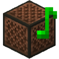

<a name="readme-top"></a>
[![Contributors][contributors-shield]][contributors-url]
[![Forks][forks-shield]][forks-url]
[![Stargazers][stars-shield]][stars-url]
[![Issues][issues-shield]][issues-url]
[![GNU General Public License][license-shield]][license-url]


<!-- PROJECT LOGO -->
<br />
<div align="center">
  <a href="https://github.com/Nat1anWasTaken/Notebot">
    
  </a>

<h3 align="center">Notebot</h3>

  <p align="center">
    A mod plays noteblock nicely for you!
    <br />
    <a href="https://github.com/Nat1anWasTaken/Notebot"><strong>Explore the docs »</strong></a>
    <br />
    <br />
    <a href="https://github.com/Nat1anWasTaken/Notebot">View Demo</a>
    ·
    <a href="https://github.com/Nat1anWasTaken/Notebot/issues">Report Bug</a>
    ·
    <a href="https://github.com/Nat1anWasTaken/Notebot/issues">Request Feature</a>
  </p>
</div>


<!-- TABLE OF CONTENTS -->
<details>
  <summary>Table of Contents</summary>
  <ol>
    <li>
      <a href="#about-the-project">About The Project</a>
      <ul>
       <ll><a href="#special-thanks">Special Thanks</a></ll>
      </ul>
    </li>
    <li>
      <a href="#getting-started">Getting Started</a>
      <ul>
        <li><a href="#for-players">For Players</a></li>
        <li><a href="#for-developers">For Developers</a></li>
      </ul>
    </li>
    <li><a href="#usage">Usage</a></li>
    <li><a href="#roadmap">Roadmap</a></li>
    <li><a href="#contributing">Contributing</a></li>
    <li><a href="#license">License</a></li>
    <li><a href="#contact">Contact</a></li>
  </ol>
</details>


<!-- ABOUT THE PROJECT -->

## About The Project

[![Product Name Screen Shot][product-screenshot]](https://l.nat1an.xyz/notebot)

I made this mod to learn how to make Minecraft mods. It's a client-side mod that plays noteblock nicely for you.

### Special Thanks

Thanks [BleachDev][bleachdev-url] for creating and open-sourcing [BleachHack][bleachhack-url]! That inspired me a lot
and this mod is heavily based on BleachHack's [Notebot][bleachhack-notebot-url] module!

<p align="right">(<a href="#readme-top">back to top</a>)</p>


<!-- GETTING STARTED -->

## Getting Started

How to use the mod.

### For Players

Download the latest release from the [Releases][releases-url] page and put it in your mods' folder.

### For Developers

If you want to contribute to the project, you can clone the repository and build it yourself.

1. Clone the repo
   ```sh
   git clone https://github.com/Nat1anWasTaken/Notebot.git
    ```
2. Make your changes
3. Run the dev client
   ```sh
   ./gradlew runClient 
   ```
4. Build the jar
   ```sh
   ./gradlew jar 
   ```

The jar will be in `build/libs/`

<p align="right">(<a href="#readme-top">back to top</a>)</p>


<!-- USAGE EXAMPLES -->

## Usage

1. Install the mod, See [Getting Started](#getting-started)
2. Put .nbs files in the `notebot/songs` folder, Note that .txt and .midi files are also supported
3. Launch the game and join a world. This is a client-side mod, so you can use it both in singleplayer and multiplayer
4. Do `/notebot queue add {song}` to add your song into the queue
5. Do `/notebot start` to start playing the song

<p align="right">(<a href="#readme-top">back to top</a>)</p>


<!-- ROADMAP -->

## Roadmap

- [x] Queue
- [x] Multi-Instruments support

See the [open issues](https://github.com/Nat1anWasTaken/Notebot/issues) for a full list of proposed features (and known
issues).

<p align="right">(<a href="#readme-top">back to top</a>)</p>


<!-- CONTRIBUTING -->

## Contributing

Contributions are what make the open source community such an amazing place to learn, inspire, and create. Any
contributions you make are **greatly appreciated**.

If you have a suggestion that would make this better, please fork the repo and create a pull request. You can also
simply open an issue with the tag "enhancement".
Don't forget to give the project a star! Thanks again!

1. Fork the Project
2. Create your Feature Branch (`git checkout -b feature/AmazingFeature`)
3. Commit your Changes (`git commit -m 'Add some AmazingFeature'`)
4. Push to the Branch (`git push origin feature/AmazingFeature`)
5. Open a Pull Request

<p align="right">(<a href="#readme-top">back to top</a>)</p>


<!-- LICENSE -->

## License

Distributed under the GNU General Public License. See `LICENSE` for more information.

<p align="right">(<a href="#readme-top">back to top</a>)</p>


<!-- CONTACT -->

## Contact

Discord - [Nat1an#0001](discord://-/users/731146912975159427) - nathan@nat1an.xyz

Project Link: [https://github.com/Nat1anWasTaken/Notebot](https://github.com/Nat1anWasTaken/Notebot)

<p align="right">(<a href="#readme-top">back to top</a>)</p>


<!-- MARKDOWN LINKS & IMAGES -->
<!-- https://www.markdownguide.org/basic-syntax/#reference-style-links -->

[contributors-shield]: https://img.shields.io/github/contributors/Nat1anWasTaken/Notebot.svg?style=for-the-badge

[contributors-url]: https://github.com/Nat1anWasTaken/Notebot/graphs/contributors

[forks-shield]: https://img.shields.io/github/forks/Nat1anWasTaken/Notebot.svg?style=for-the-badge

[forks-url]: https://github.com/Nat1anWasTaken/Notebot/network/members

[stars-shield]: https://img.shields.io/github/stars/Nat1anWasTaken/Notebot.svg?style=for-the-badge

[stars-url]: https://github.com/Nat1anWasTaken/Notebot/stargazers

[releases-url]: https://github.com/Nat1anWasTaken/Notebot/releases

[issues-shield]: https://img.shields.io/github/issues/Nat1anWasTaken/Notebot.svg?style=for-the-badge

[issues-url]: https://github.com/Nat1anWasTaken/Notebot/issues

[license-shield]: https://img.shields.io/github/license/Nat1anWasTaken/Notebot?style=for-the-badge

[license-url]: https://github.com/Nat1anWasTaken/Notebot/blob/master/LICENSE

[product-screenshot]: imgs/screenshot.png

[bleachdev-url]: https://github.com/BleachDev

[bleachhack-url]: https://github.com/BleachDev/BleachHack

[bleachhack-notebot-url]: https://github.com/BleachDev/BleachHack/blob/1.19.4/src/main/java/org/bleachhack/module/mods/Notebot.java